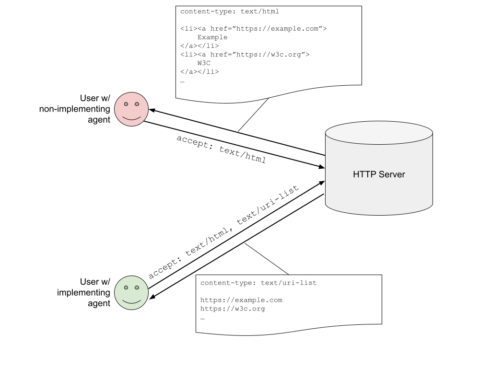
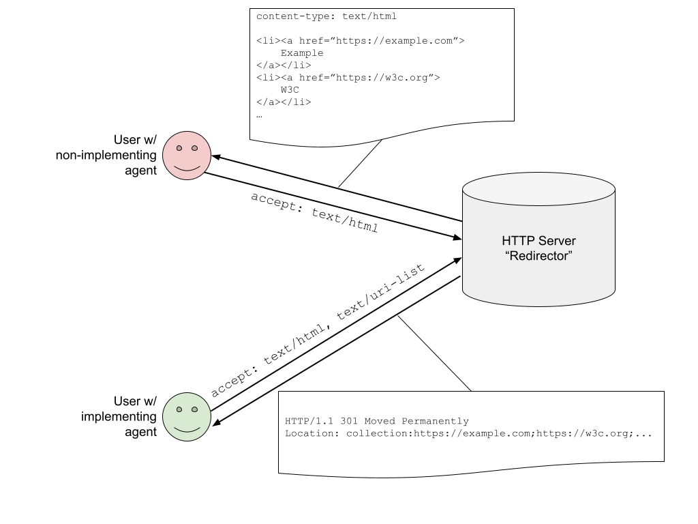

# Page Collection

## Summary

This is a proposal to enable representing multiple links as a single unit, enabling users and authors to group multiple pages into a single link. An agent navigating to a page collection link will load and present all the collection’s pages in a grouping UI. We're calling such a link a "page collection".

Today, sharing multiple pages requires sharing a list of links. A receiving user must manually open each link in sequence. In some cases (when links are received in a native app), a user has no choice but to context switch between app and browser with each link. The user’s browser is unable to automatically organize and manage these related pages.

Page collections aims to allow the user agent to be more helpful in opening and presenting multiple related pages.

This explainer details ideas and challenges for this new form of linking. While some examples are provided, no grouping UI is suggested or mandated by this proposal; how such a link is presented is left to the discretion of the user agent.

## Status

This is a very early-stages proposal. We're looking for feedback about the ideas and feasibility. This explainer will evolve as the idea is refined. Critiques, alternate approaches and ideas are all welcome.

## Example Use Cases

* User-to-User sharing and collaboration 

  Alice and Bob are planning to take a summer trip together and are planning their vacation.

  Alice does some research on potential accommodations and collects various options in open tabs in her browser. She requests that her browser generate a link from the multiple tabs into a single page collection link.
  
  <p align="center"></p>
  
  Alice sends the link to Bob for review via a messaging app.
  
  <p align="center"></p>
  
  Bob clicks on the link which opens a tab group in his browser containing all the options Alice has presented.
    
  <p align="center"></p>
    
* Publishing
  
  An industry newsletter collects interesting news stories (from various sites across the web) relevant to its subscribers. Each week it collects the stories into a single page collection link and adds the link to the weekly newsletter.

  Each Monday, Pat opens the link to read the week’s news. Pat’s browser opens the collection as a carousel, allowing Pat to easily flip through the week’s news stories.
    
* Commerce

  A small digital retailer wants to provide a comparison function on their website. Users can select multiple products and click “Compare”, which opens a collection featuring all the selected products.

  Jen is shopping for headphones and is trying to decide between models. Jen uses the retailer’s comparison function to open a collection featuring headphones she’s interested in. Her browser allows her to put the collection in a comparison mode with side-by-side panes, allowing her to easily compare features of the various headphones.

* Native-to-Web

  A native email client provides an “Open All Links'' functionality for received mail.

  Jasmine receives a message from a colleague asking her to review several drafts. She clicks on “Open All Links” and the mail  client collects all links in the message and concatenates them into a single page collection link. The client then invokes an OS API to open a URL with this link.

  Jasmine’s default browser is opened and displays a collection featuring all of the links from the e-mail message. Jasmine reviews all the drafts before returning to her mailbox to reply to her colleague.

## UI Treatment
    
Opening multiple pages simultaneously requires a user’s browser to have some kind of UI to manage multiple pages.

Most web browsers today have a notion of tabs; some browsers have a UI for grouping multiple tabs together. An example of this is “Tab Groups”, available in Safari, and Chrome. Such browsers could open a page collection link in a tab group, or share a tab group as a page collection link. At a minimum, a browser could display a page collection as a list of clickable hyperlinks.

We envision browsers experimenting with new kinds of UIs in the future. For this reason, this proposal is UI agnostic. References to UI are provided for illustrative purposes but the exact mechanism of how an agent wishes to present a collection of links would be left to the agent’s discretion. This proposal focuses instead on the specifics of the linking mechanism to ensure such links would be interoperable on the web.

_Note: In addition, browsers could provide users with a convenient UI to create collection links; for example, by selecting multiple tabs to share. However, this doesn’t affect interoperability of these links so isn’t discussed here._

## Potential Implementations
    
We’re currently considering two options, with various trade-offs related to considerations in the sections that follow. These can be adopted either separately or together.
    
### HTTP Server Based
    
Browsers receiving a `text/uri-list` MIME type open it as a collection of pages in a grouped UI. To enable feature detection, conforming browsers would send the HTTP header `accept: text/uri-list` to let the server know that it’ll open a URI list in a grouped UI.

* _Question: can we add text/uri-list to all requests? Is that feasible performance-wise?_
* _Question: can we reuse text/uri-list for this? Can we extend it to support some light options? E.g. theme-color, UI hints, etc. or would a new type be preferable?_

This enables authors and anyone with the ability to configure a server to share such links while providing a customized fallback for non-conforming user agents. It also relies entirely on existing web platform mechanisms.

<p align="center"></p>
  
Advantages
* Can feature detect at navigation time and serve a fallback
* Serving `text/uri-list` to a non-conforming agent renders a plaintext representation
* Uses existing web platform mechanisms

Disadvantages
* Requires a server and technical skills to create a page collection link
  * Links must be stored on a server
  * Link rot - lifetime of the link depends on the server
* Privacy - link contents are visible to the server operator
* Unknown whether a link will open a collection (and can be changed over time)
    * Could be mitigated by requiring an attribute on a link, e.g. `<a href="..." allow="page-collection">`

#### Customization

It may be useful for link creators to customize the collection in various ways. Some examples:

* Provide a title for each page so the user agent can provide a human-readable list without fetching additional resources.
* A “theme-color” that UI could use when presenting this collection
* A "suggested-layout" that could suggest a preferred UI (e.g. "tab-group", "carousel", "side-by-side", etc.)
* A “title” that applies to the entire collection
  * _Note: this has potential for misleading/phishing users so may not be a good idea_
* A “favicon” that applies to the entire collection
  * _Note: this has potential for misleading/phishing users so may not be a good idea_

`text/uri-list` allows for comments by starting lines with a `#` character. A page collection can encode hints in comments to enable implementing UAs to customize the experience for users, e.g.

```
<RESPONSE>
content-type: text/uri-list

#title: Cantor's Diagonal Argument
https://en.wikipedia.org/wiki/Cantor%27s_diagonal_argument
#title: Cantor's First Set Theory
https://en.wikipedia.org/wiki/Cantor%27s_first_set_theory_article
#title: Cantor's Theorem
https://en.wikipedia.org/wiki/Cantor%27s_theorem
#title: Countable Set
https://en.wikipedia.org/wiki/Countable_set
#title: Uncountable Set
https://en.wikipedia.org/wiki/Uncountable_set
#page-collection-hints
#{
#   theme-color: 'white',
#   title: 'Real analysis research',
#   favicon: 'https://en.wikipedia.org/favicon.ico'
#}
```

This mechanism could be used to extend functionality in the future.

#### What's being proposed?

This approach doesn’t require any fundamental new features in the web platform so what's the proposal?

Today, most user agents will simply display `text/uri-list` as a plaintext file.

The above section proposes:

 * Standardizing user agents to present `text/uri-list` in a more user-friendly way, at a minimum, providing a clickable list of links to the user.
 * Implementing user agents send an `accept: text/uri-list` header in the request to inform the server it can present it in a user-friendly way
 * Standardize the comment-based micro syntax, providing hints that agents can use to improve the visual presentation of the collection.


### URI Based
  
The server based approach is a high bar for a typical user that just wants to share a set of tabs with a friend. User agents and third-parties can provide services that enable users to create and host such links but these come with various drawbacks related to usability, privacy, and robustness.

A URI based approach enables anyone to encode multiple resources into a single URI. A new URI scheme tells the user agent that the URI is a collection of links:

```
collection:https://example.com;https://acme.org;https://w3c.org{theme-color:blue}
```

Advantages
* No need to host the link
* Lifetime of collection is unbounded
* Clearer to users and agents that the link is a collection, not an ordinary link
* Can be easily modified, copied, pasted, etc.

Disadvantages
* Very long links
* For user-to-user sharing, can’t feature detect. Failure is a broken link
* Initially, linkifiers (e.g. in a chat apps) may not catch that the received collection is a link

The last two disadvantages would hopefully dissipate over time; if most user agents adopt the proposal, feature detection would become less of an issue and the most popular linkifiers would be updated to support the new scheme.

In the meantime, these drawbacks could be mitigated by the server based approach or by wrapping collection links behind a feature detection service that redirects implementing browsers to the collection and others to a fallback:

<p align="center"></p>


## Considerations

### Interoperability

Users and authors should be confident that their page collection links won’t result in a broken experience for recipients using a non-implementing user agent. While we intend and hope for page collections to become a standard implemented by all user agents, there will be un-updated user agents and certainly a period where support varies. Links across the web should work for all users.

We’ve considered several approaches for how to mitigate this:

* Provide feature detection so authors wishing to serve this to their users can detect whether the user agent lacks this capability and serve a list of plain links instead.

* Use a `text/uri-list` or similar MIME type response to indicate a page collection. On non-implementing user agents this will fallback to displaying the response which at least provides users with a listing of links. As a stop gap, non implementing user agents could linkify a `text/uri-list` response to make it easy for users to navigate through the list.

* Sharing features can wrap links in a redirector service which can feature detect whether the user’s browser supports page collections natively and redirect to either a page collection link or a fallback page.

These approaches are explored in more detail in the Potential Impementations section above.

### Abuse and Security

We’ve considered some avenues for abuse and how they can be mitigated:

* Using collection links to spam a large number of popups.

  Most browsers today include a popup blocker. Page collection links should also be blocked unless the user took an action.

  An opened page collection should be grouped in the browser’s UI somehow so that an unwanted link doesn’t disorient or frustrate a user and the whole group can be easily closed at once.

* Resource usage

  A page collection could be made to include many pages. Naively opening such a link could lead to degrading the performance of the user's device or crashing it altogether. Additionally, some browsers attempt to put origins into their own processes as a mitigation against [Spectre](https://leaky.page/)-like attacks. If an attacker can exhaust a user’s system resources they can force these defenses off.

  To mitigate this, user agents should avoid loading pages until they’re presented (or about to be presented) to the user.

  Some user agents already have similar “tab throttling” mechanisms for background tabs or when restoring sessions with many tabs.

  Page collections could have a user-agent defined limit on the number of URLs in a collection; URLs beyond this limit would be truncated. A minimum could be standardized that would be guaranteed to work on all conforming agents. The agent can also provide UI to warn users about a large number of pages and ask for confirmation before opening.

  User agents are also free to decide how many pages in a collection can be concurrently presented/loaded.

* Leaking data

  Pages authored in a specific way can sometimes make themselves vulnerable to data leaks. For example, leaking scroll offsets in combination with fragment-ids or [Scroll-to-Text](https://xsleaks.dev/docs/attacks/experiments/scroll-to-text-fragment/). The single-navigation-per-click model of the web limits these leaks to a single bit. Enabling an attacker to load multiple pages simultaneously could be used to expand the scope of such attacks.

  Similarly, there are [efforts to prevent user tracking](https://privacycg.github.io/nav-tracking-mitigations/) via URL parameters. Being able to open multiple links simultaneously could complicate those efforts (eg. by spreading user identifiers over multiple URLs/page loads).

* Link obfuscation

  It’s helpful for users to see where a link will take them before clicking on it. Most user agents (when using a hover capable device, e.g. a mouse) show a link’s URL on hover.

  A collection of links complicates this since the existing UI cannot convey to the user all the pages the link will load.

  Today, link URLs can be obfuscated by malicious parties, for example: by changing the URL in a mousedown handler, so we don’t think page collections would make the situation materially worse.

  However, to avoid surprising users, browsers can provide new UI to help users decide whether to open a collection. For example, by showing an interstitial popup when clicked that shows how many links are contained and a list of origins.

* Phishing

  Care must be taken to prevent collections becoming a vector for phishing and related attacks. For example, disguising a malicious link within a list of trusted origins:

  ```
  collection:https://mybank.com/;https://mybank.evil.com/login;login.example.com
  ```

  User agents will load these URLs in their normal way, which includes any kind of phishing and malicious site detection services, for example, Google’s [SafeBrowsing](https://safebrowsing.google.com/) service.


Browsers may require a per-origin permission to open page collections to mitigate these risks.


### Privacy
  
In the case of server-based links or feature-detecting redirectors, the operators of those servers are responsible for storing the page addresses contained by the collection. Users would have to be aware that links they share using these services would be visible to the operator of the service.

Example: A user downloads an extension “Foobar” to generate collection links. The user selects multiple tabs and asks Foobar for a collection link to the selected tabs. Foobar uploads the URLs of the selected tabs to `https://foobar.com/upload` and provides a collection link the user can use to access it: `https://foobar.com/abcdefg`. The user shares this link with a friend; when loaded, the link opens all the same tabs in the friend’s browser. The page addresses in the collection are visible not only to the user and their friend but also to the operator of `foobar.com`.

Customization properties that issue requests (or simply tagged on URLs) could be used to send unintended information to a third party (e.g. a sender getting “read receipt” that their recipient has clicked on the page-collection link).


### Accessibility

User agents should identify links as pointing to a collection when this is possible. This should be done in a way that’s available to accessibility tools like screen readers.

User agents should also take care to prevent cognitively overwhelming users when opening a large collection. For example, by limiting how many pages are displayed in the UI at once.

All the usual accessibility issues in UI apply; however, we believe these are all addressable given browsers’ existing multi-page tab UIs.


## Prior Art
  
* [text/uri-list](https://www.ietf.org/rfc/rfc2483.txt) - A MIME type for sending multiple URIs. Often used as a mime type when dragging links.

* [text/x-moz-uri](https://developer.mozilla.org/en-US/docs/Web/API/HTML_Drag_and_Drop_API/Recommended_drag_types#:~:text=Mozilla%2Dspecific%20type-,text/x%2Dmoz%2Durl,-.%20If%20it%20appears) - Similar to above but allows providing titles for each URI

* [Open Multiple URLs](https://github.com/htrinter/Open-Multiple-URLs/) - Chrome and Firefox extension

## Alternatives Considered
  
### data:text/html URI
  
Using a `data:text/html` URI to navigate to an HTML page containing a list of the links, or feature-detect and redirect to a `collection:` link.

This was discarded as an option as `data:` URIs are considered non-secure, would lead to exceptionally messy URIs, and would be difficult to linkify in messaging apps.

### Fragment Directive

Use a new fragment directive to append a list of URLs as a page collection:

```
https://firstpage.com#:~:collection=https://secondpage.com;https://thirdpage.com
```

Fragment directives are stripped from the URL during navigation, so they won’t cause unintended interactions with script on the page.

This has the benefit that a user opening this link in a non-implementing user agent will load `firstpage.com`, rather than seeing an error page.

This option was rejected since an error page may actually be a less-confusing experience compared to receiving a single part of a collection.

