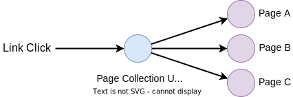
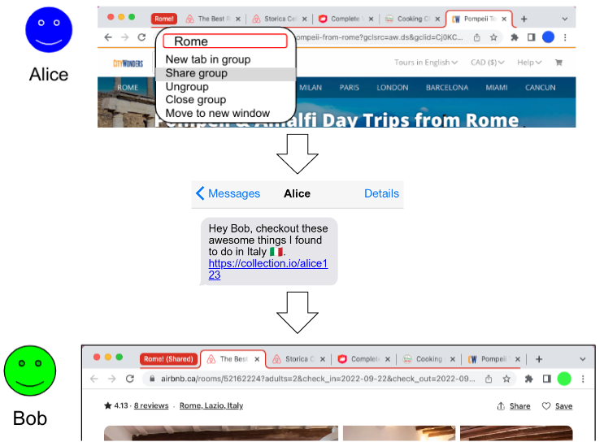
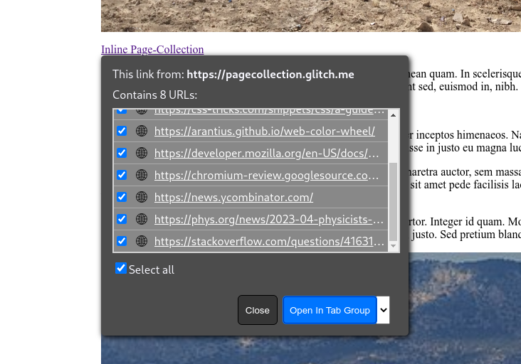

# Multilinks

## Summary

It's common for users browsing the web to open and refer to multiple pages in a single journey. For example, when doing research on a
complex topic, comparing products when shopping, or planning a trip or outing. Browsers have facilitated this by introducing tabbed UIs and
allowing grouping of related tabs.

It's also common for users to share content with others, get their thoughts, and make decisions together. Yet, the web's sharing mechanism,
the link, remains 1-to-1; one link opens one page. This makes it cumbersome to share complicated context.

This is a proposal to enable grouping multiple destinations into a single link, a 1-to-many link. A browser opening such a link will open
each of the constituent pages in a grouping UI, such as a tab group.

<p align="center"></p>

A concrete example: get a single link for all the pages in your tab group. Share the link with a friend. The friend clicks the link to open a tab
group containing the same pages.

We call this a "multilink", an example of how it _might_ look:

```
multi:https://example.com/pageA;https://en.wikipedia.org/wiki/URL;https://w3.org
```

This explainer details challenges and ideas for this new form of linking. While some examples of a multilink "view" UI are provided, particularly
with existing mechanisms such as tab groups, no specific UI is suggested or mandated in this proposal; the view into which a multilink is presented is
left to the discretion of the user agent.

### Non-Goals

  * Resource Bundling - each constituent link in a multilink is intended to be an individual destination for the end user. They are grouped
    because they are related somehow within the user's journey but there is no implied dependency or relationship between the constituent
    links themselves.
  * Interoperable collaboration - there are emerging features that allow users to live-collaborate on a [shared group of
    tabs](#shared-tab-groups). While there's some overlap and potential for multilinks to improve these features in the short term,
    our goal is to instead enable a richer linking primitive.

## Status

This is a very early-stages proposal. We're looking for feedback about the ideas and feasibility. This explainer will evolve as the idea is
refined. Critiques, alternate approaches and ideas are all welcome. Feel free to file issues.

## Example Use Cases

* User-to-User sharing

  Alice and Bob are planning to take a summer trip together and are planning their vacation.

  Alice does some research on potential accommodations and collects various options in open tabs in her browser. She requests that her
  browser generate a link from the multiple tabs into a single multilink. Alice sends the link to Bob for review via a messaging
  app. Bob opens the link in his browser which opens a tab group containing all the options Alice has presented.

  <p align="center"></p>

* Publishing

  An industry newsletter collects interesting news stories (from various sites across the web) relevant to its subscribers. Each week it collects the
  stories into a single multilink and adds the link to the weekly newsletter.

  Each Monday, Pat opens the link to read the week’s news. Pat’s browser opens the multilink as a carousel, allowing Pat to easily flip through the
  week’s news stories.

* Commerce

  A small digital retailer wants to provide a comparison function on their website. Users can select multiple products and click “Compare”, which
  opens a multilink featuring all the selected products.

  Jen is shopping for headphones and is trying to decide between models. Jen uses the retailer’s comparison function for headphones she’s interested
  in. Her browser allows her to put the multilink view in a comparison mode with side-by-side panes, allowing her to easily compare features of the
  various headphones.

* Native-to-Web

  A native email client provides an “Open All Links'' functionality for received mail.

  Jasmine receives a message from a colleague asking her to review several drafts. She clicks on “Open All Links” and the mail client collects all
  links in the message and concatenates them into a multilink. The client then invokes an OS API to open a URL with the multilink.

  Jasmine’s default browser is opened and displays a view featuring all of the links from the e-mail message. Jasmine reviews all the drafts before
  returning to her mailbox to reply to her colleague.

* Many more: academic research/reading, company onboarding, etc.

## UI Treatment

Opening multiple pages simultaneously requires a user’s browser to have some kind of UI to manage multiple pages.

Most web browsers today have a notion of tabs; some browsers have a UI for grouping multiple tabs together. An example of this is “Tab Groups”,
available in [Safari](https://support.apple.com/en-ca/guide/safari/ibrwa2d73908/mac), and
[Chrome](https://blog.google/products/chrome/manage-tabs-with-google-chrome/). Such browsers could open a multilink in a tab group. Conversely, they
could allow sharing a tab group using a multilink. At a minimum, a browser can render a multilink as an ordinary HTML document with a list of
clickable hyperlinks.

We envision browsers experimenting with new kinds of UIs in the future. For this reason, this proposal is UI agnostic. References to UI are provided
for illustrative purposes but the exact view mechanism used when a multilink is navigated would be left to the user agent’s discretion.

We'll use the generic term "multilink view" when referring to the UI that a multilink opens into. A tab group is one possible multilink view.

_Note: In addition, browsers could provide users with a convenient UI to *create* multilinks; for example, by selecting multiple tabs to share. However, this
doesn’t affect interoperability of these links so isn’t discussed here._

### Shared Tab Groups

In addition to the general "tab groups" feature available in some browsers, sharing tab groups is available in Safari, via [Shared Tab
Groups](https://support.apple.com/en-ca/guide/safari/ibrw7f189b02/mac), and in Edge, via [Edge
Workspaces](https://learn.microsoft.com/en-us/deployedge/microsoft-edge-workspaces).

Both heavily focus on "live collaboration" features that are out of scope for multilinks but the basic premise is to share a group
of tabs with other users. Both cases currently work with a proprietary link that isn't functional outside their respective browser.

Multilinks could serve as a base layer of interoperability - users in all browsers would at least be able to access the shared tabs,
with additional proprietary features available when opened from matching browsers.

## Proposal

### Summarized Web-Facing Changes

  * Introduce a `multi:` URL scheme that encodes multiple constituent links into a single multilink.
  * Allow a server-based fallback for non-implementing agents via `<link rel="alternate">`.
  * Add an opt-in for anchor elements enabling them to open a non-`multi` scheme URL as a multilink.
    * When used with the above fallback.
  * Define restrictions for when a multilink can open multiple pages.

### Introduce a new URL scheme: multi

As noted in [WebArch](https://www.w3.org/TR/webarch/#URI-scheme:~:text=While%20Web%20architecture%20allows%20the%20definition%20of%20new%20schemes),
introducing a new URL scheme is costly. This section explains the drawbacks of the considered alternatives and why a new URL scheme is the best option
despite the costs. More details on alternatives are in the [alternatives considered](#alternatives-considered) section.

Some alternatives we've considered:

  * A new HTML element (e.g. `<anchor-list>`)
  * A new attribute on the existing `<a>` element.
  * A plain HTTP URL to a server responding with a `Content-Type: text/uri-list` header and a list of constituent links in the response body.

Each of these comes with significant drawbacks:

  * Each requires a user to author a document or host a server. This requires time, effort, and technical skill, excluding a majority of the web’s
    users.
  * The HTML-based approaches require the user to own the HTML on which the link will be shared (precludes chat or social media without site support,
    SMS entirely).
  * The server-side approach:
    * Requires an extra layer of indirection so its lifetime additionally relies on the intermediate server. I.e. if the server is ever decommissioned
      or moved to a new address, the link becomes broken.
    * Adds network latency.
    * A user sharing such a link must trust whoever will serve the response, making it more difficult to share a link privately.

There are good reasons why a user may still wish to add a layer of indirection, e.g. to shorten a long list into a convenient short URL, or to enable
detection of non-implementing agents to provide an alternate representation. However, this choice should be left to users and applications.

Another method that does avoid indirection is to use a data URL (defined in [RFC2397](https://www.rfc-editor.org/rfc/rfc2397)) with a `text/uri-list`
media type:

```
  data:text/uri-list,https://example.com/1%0Dhttps://example.com/2
```

However, links like this have usability issues that would be more easily addressed with a new scheme:

* Users of communication apps (e.g. instant messaging, e-mail, etc.) often rely on the app “linkifying” a plaintext URL so the recipient can
  open it with a click. This doesn't happen for `data:` URLs. While a new scheme will also require updates in such apps to support linkification,
  `multi:` is less flexible than `data:`, making this more straightforward for linkifier software.
* `data:` URLs can contain any kind of data, including executable script. Users can (and should) be wary of opening such links. Promoting them might
  unintentionally train users to be more trusting of potentially unsafe `data:` links.
* Because `data:` URLs can be dangerous, they’re explicitly blocked in certain contexts. For example, most web browsers block `data:` URLs in anchor
  links. Some browsers block HTTP redirects to `data:` URLs. Basing security restrictions on a `data:`'s media type seems unappealing.
* The `text/uri-list` media type uses newlines as a delimiter and accepts comments, making for messier links. A `multi:` scheme allows for a
  friendlier syntax and mapping.

The proposed `multi:` scheme is very similar to `data:text/uri-list`, albeit with a dedicated syntax and more user-friendly form. When a user-agent
operates on a `multi:`, it will parse the inline data into a list of URLs to open. Here's an example of a `multi` link:

```
multi:https://example.com;https://acme.org;https://w3c.org
```

Which is mapped to:

```
https://example.com
https://acme.org
https://w3c.org
```

The `multi` URL can also support query parameters for configuration options, e.g.:

```
multi:https://example.com;https://acme.org;https://w3c.org?group-name=Research%20links
```

Note that this is unambiguous as the `multi` scheme grammar requires percent-encoding `?` characters in the component URLs. The scheme is defined in
more detail in [this draft](uri-scheme.md).

Only a single configuration option will be supported initially: `group-name`. User agents can use this to give a label the group of opened pages in
its UI.

Unrecognized options will be ignored.

### Fallback and Feature Detection

The experience of opening a multilink in a non-implementing user agent will be poor: unrecognized schemes will result in an error or request the user
to pick a handler app. In order to guarantee a baseline experience, it's expected that a common use case (until most users' browsers add support) will
be to use a "redirector" service which provides a fallback HTML page for non-implementing browsers while being interpreted by implementing browsers as
a multilink.

Such a service can respond with an ordinary `text/html` document but include a `<link>` to the desired multilink. Implementing agents can immediately
"redirect" the user to the multilink view while a non-implementing agent will render the HTML document which can render the multilink as a list of
clickable hyperlinks, for [example](https://pagecollection.glitch.me/link.html):

```
  <!DOCTYPE html>
  <html>
    <head>
      <link rel="alternate" href="multi:https://example.com;https://example2.com">
      <script>
        const urls = document.querySelector('link').href.substr(6).split(';');
        for (let url of urls) {
          // ...
        }
      </script>
      ...
```

Additionally, web authors wishing to provide multilinks from their HTML documents can conditionally include them by feature detecting on the client.

TODO ([Issue#9](https://github.com/bokand/page-collection/issues/9): How do we support script-based feature detection? Perhaps `'multilink' in
navigator`?

### Anchor link opt-in

The `<link>` based fallback enables ordinary `http(s)` scheme links to return a multilink resource. This may be surprising and undesirable for authors
in some cases. Additionally, it makes it difficult for a user agent to determine ahead of time if a link may be a multilink (a useful property for UI).

The solution is for authors providing multilinks to be explicit about it. We enable this by adding a new `rel` attribute value `multilink` to let
authors annotate which anchors *may* open a multilink. Using a `multi` scheme URL in the anchor's `href` is itself explicit enough and does not require
`rel=multilink`.

Examples:

```html
<!-- This link will open in a multilink view if the response HTML contains a multilink in a <link>. Otherwise it behaves as a normal link -->
<a href="http://redirect.to?u=my-multilink" rel="multilink">HTML response</a>

<!-- This link will always open in a multilink view -->
<a href="multi:example.com/my-multilink">multi: scheme</a>

<!-- This link will not automatically open in a multilink view, even if the response contains a multilink <link>-->
<a href="http://redirect.to?u=my-multilink">HTML response</a>
```

Note: To "block" means to avoid opening all the links simultaneously. The user agent may degrade gracefully by showing a single-page view listing the
links (see below).

### Restrictions

To prevent abuse, user agents may place restrictions on when a multilink is allowed to open into a multilink view:

 * Requiring `rel=multilink` on `<a>` or `<area>` and an equivalent `windowFeature` for `window.open`.
 * The user must explicitly agree to open the multilink view via some sort of confirmation UI. For
   [example](https://pagecollection.glitch.me/prompt.html):
   <p align="center"></p>

In the absence of these requirements the user agent can gracefully degrade to a less functional single page fallback. For example: an HTML page with
list of clickable links, perhaps with an option to open into the multilink view UI.

  <p align="center"></p>

<p align="center">
  <em>An <a href="https://pagecollection.glitch.me/fallback.html">example</a> of what the fallback might look like.</em>
</p>

## Considerations

### Interoperability

Users and authors should be confident that their multilinks won’t result in a broken experience for recipients using a non-implementing user agent.
While we intend and hope for multilinks to become a standard implemented by all user agents, there will be un-updated user agents and certainly
a period where support is mixed. Links across the web should work for all users.

To this end, multilinks allow:

* Serving a graceful fallback via the `<link href="multi:..." rel="alternate">` mechanism.

* JavaScript-based feature detection so authors wishing to provide multilinks to their users can feature detect (TODO: determine the right mechanism).

### Abuse and Security

We’ve considered some avenues for abuse and how they can be mitigated:

* Using multilinks to spam a large number of popups.

  Most browsers today include a popup blocker. Multilinks should also be blocked unless the user took an action. Before opening a multilink view, the
  browser can show the user a confirmation dialog, allowing them to see the URLs and take different actions or cancel. See
  [Restrictions](#restrictions).

  An opened multilink should be grouped in the browser’s UI somehow so that an unwanted multilink doesn’t disorient or frustrate a user and the whole
  group can be easily closed at once.

* Resource usage

  A multilink could be made to include many pages. Naively opening such a link could lead to degrading the performance of the user's device or
  crashing it altogether. Additionally, some browsers attempt to put origins into their own processes as a mitigation against
  [Spectre](https://leaky.page/)-like attacks. If an attacker can exhaust a user’s system resources they can force these defenses off.

  To mitigate this, user agents should avoid loading pages until they’re presented (or the user agent believes they're about to be presented) to the
  user. Some user agents already have similar “tab throttling” mechanisms for background tabs or when restoring sessions with many tabs.

  Multilinks could have a user-agent defined limit on the number of constituent links that can be simultaneously opened; constituent links beyond this
  limit would be truncated. A minimum could be standardized that would be guaranteed to work on all conforming agents. The agent can also provide UI
  to warn users about a large number of pages and ask for confirmation before opening.

  User agents are also free to decide how many pages in a multilink can be concurrently presented/loaded.

* Leaking data

  Pages authored in a specific way can sometimes make themselves vulnerable to data leaks. For example, leaking scroll offsets in combination with
  fragment-ids or [Scroll-to-Text](https://xsleaks.dev/docs/attacks/experiments/scroll-to-text-fragment/). The single-navigation-per-click model of
  the web limits these leaks to a single bit. Enabling an attacker to load multiple pages simultaneously could be used to expand the scope of such
  attacks.

  Similarly, there are [efforts to prevent user tracking](https://privacycg.github.io/nav-tracking-mitigations/) via URL parameters. Being able to
  open multiple links simultaneously could complicate those efforts (eg. by spreading user identifiers over multiple URLs/page loads).

* Link obfuscation

  It’s helpful for users to see where a link will take them before clicking on it. Most user agents (when using a hover capable device, e.g. a mouse)
  show a link’s URL on hover.

  A multilink complicates this since the existing UI cannot convey to the user all the pages the link will load.

  Today, link URLs can be obfuscated by malicious parties, for example: by changing the URL in a mousedown handler, so we don’t think multilinks would
  make the situation materially worse.

  However, to avoid surprising users, browsers can provide new UI to help users decide whether to open a multilink. For example, by showing an
  interstitial popup when clicked that shows how many links are contained and a list of origins.

* Phishing

  Care must be taken to prevent multilinks becoming a vector for phishing and related attacks. For example, disguising a malicious link within a list
  of trusted origins:

  ```
  multi:https://mybank.com/;https://mybank.evil.com/login;login.example.com
  ```

  User agents will load these URLs in their normal way, which includes any kind of phishing and malicious site detection services, for example,
  Google’s [SafeBrowsing](https://safebrowsing.google.com/) service.


### Privacy

Due to link length and initial interop challenges, we expect that a feature-detecting redirector would be a popular way to share multilinks. In
this mode, the operator of such a service is responsible for storing the constituent links contained in the multilink. It's unclear if users would be
aware that links they share using these services would be visible to the operator of the service.

Example: A user downloads an extension “Foobar” to generate multilinks. The user selects multiple tabs and asks Foobar for a multilink to the selected
tabs. Foobar uploads the URLs of the selected tabs to `https://foobar.com/upload` and returns a short URL to the user to access it:
`https://foobar.com/abcdefg`. The user shares this link with a friend. When loaded, the link opens all the same tabs in the friend’s browser. The
constituent URLs of the multilink are visible not only to the user and their friend but also to the operator of `foobar.com`.

Multilinks could be used to send unintended information to a third party. For example, a sender could turn their plain link to `example.com` into a
multilink containing `example.com;sender.com`. When the user agent issues a request to `sender.com` this could function as a “read receipt” that
their recipient has clicked on the link.


### Accessibility

User agents should identify links as multilinks when this is possible. This should be done in a way that’s available to accessibility tools like
screen readers.

User agents should also take care to prevent cognitively overwhelming users when opening a large multilink. For example, by limiting how many pages
are displayed in the UI at once.

All the usual accessibility issues in UI apply; however, we believe these are all addressable given browsers’ existing multi-page tab UIs.


## Prior Art
  
* [text/uri-list](https://www.ietf.org/rfc/rfc2483.txt) - A media type for sending multiple URLs. Often used as the type when dragging links.

* [text/x-moz-uri](https://developer.mozilla.org/en-US/docs/Web/API/HTML_Drag_and_Drop_API/Recommended_drag_types#:~:text=Mozilla%2Dspecific%20type-,text/x%2Dmoz%2Durl,-.%20If%20it%20appears)
  Similar to above but allows providing titles for each URL

* [Open Multiple URLs](https://github.com/htrinter/Open-Multiple-URLs/) - Chrome and Firefox extension

## Appendix

### Alternatives Considered

#### Content-Type: text/uri-list

Make browsers process a `Content-Type: text/uri-list` response in a user-friendly way.

`text/uri-list` is an existing media type in the [IANA media types registry](https://www.iana.org/assignments/media-types/media-types.xhtml).
It is defined by [RFC2483](https://www.rfc-editor.org/rfc/rfc2483.html#section-5).

Here’s an example of valid `text/uri-list` content:

```
# This is a comment
# A link about dogs
https://en.wikipedia.org/wiki/Dog#Intelligence
# Links about cats
https://en.wikipedia.org/wiki/Cat
https://www.reddit.com/r/catmemes/
```

Today, most browsers render such a response as plain text (a usable fallback for non-implementing user agents!).

In this approach, an ordinary HTTP-scheme link would respond with a `Content-Type: text/uri-list` header. User agents would interpret this content type
as a multilink and attempt open each constituent link.

Feature detection/fallback can be provided by using content negotiation - the browser can add `text/uri-list` to the `Accept:` header of any request
originating from a link with `rel=multilink`.

The main drawback is that this _forces_ multilinks to be hosted on a server which adds indirection and reduces privacy. While the plaintext fallback
in non-implementing agents is better than the failure-mode for the `multi`-scheme, it's still not very usable so would likely require a
linkified-fallback anyway.

Note: while this approach isn't our primary proposal it can be cheaply implemented side-by-side with the `multi`-scheme. The two approaches could be
complementary.

#### data:text/html URL
  
Using a `data:text/html` URL to navigate to an HTML page containing a list of the links, or feature-detect and redirect to a `multi:` URL.

This was discarded as an option as `data:` URLs are considered non-secure - even if they could be linkified, we don't want to train users to click on
`data:` links.

They'd also lead to exceptionally messy URLs, and would be difficult to linkify in messaging apps.

#### Fragment Directive

Use a new fragment directive to append a list of URLs as a multilink:

```
https://firstpage.com#:~:multi=https://secondpage.com;https://thirdpage.com
```

Fragment directives are stripped from the URL during navigation, so they won’t cause unintended interactions with script on the page.

This has the benefit that a user opening this link in a non-implementing user agent will load `firstpage.com`, rather than seeing an error page.

This option was rejected since an error page may actually be a less-confusing experience compared to receiving a single part of a multilink.

#### HTML

Amend HTML to allow anchor links to include multiple URLs, for example:

```html
<a hrefset="https://example1.com, https://example2.com">Multilink</a>
```

This approach could work for anyone with the ability to author a page but precludes direct user-to-user sharing.

It also precludes native-to-web use cases, such as opening a multilink from a user's native email client.
