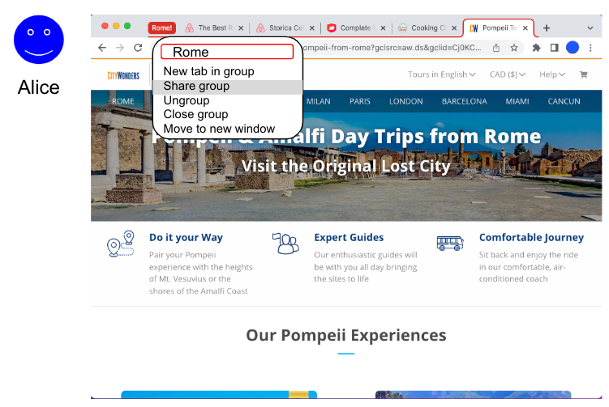
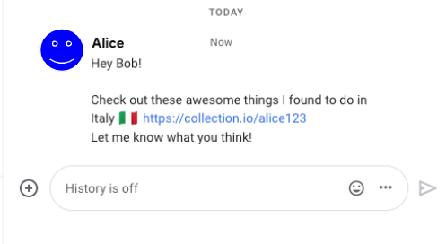
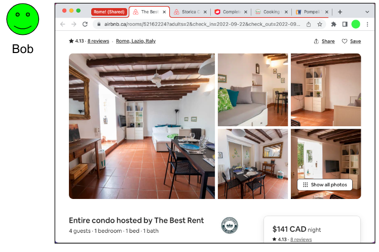
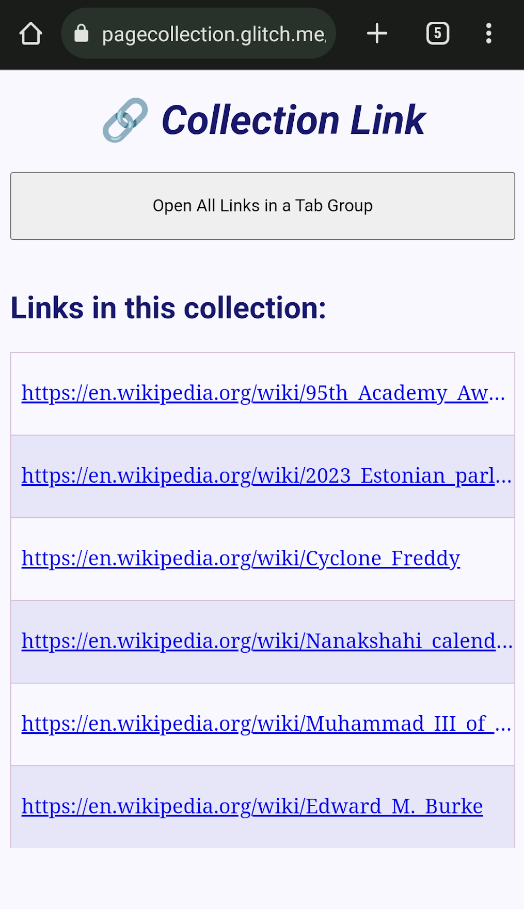

# Page Collection

## Summary

This is a proposal to enable users and authors to group multiple resources into a single link. An agent navigating to such a link will load and present all its resources in a grouping UI. We're calling such a link a "page collection":

```
uri-list:https://example.com/pageA;https://en.wikipedia.org/wiki/URL;https://w3.org
```

Page collections aims to allow the user agent to be more helpful in opening and presenting multiple related pages.

This explainer details ideas and challenges for this new form of linking. While some examples are provided, no grouping UI is suggested or mandated by this proposal; how such a link is presented is left to the discretion of the user agent.

### Summarized Web-Facing Changes

  * Specify web browser handling of `text/uri-list` media types.
  * Introduce a `uri-list:` URI scheme to allow users to easily share collection links.
  * Add an opt-in for for anchors to non-`uri-list` schemes to allow opening a collection.
  * Define a permission model for when a collection link may open multiple windows.
  * Use content negotiation to allow servers to feature detect user agents capable of handling text/uri-list.

## Status

This is a very early-stages proposal. We're looking for feedback about the ideas and feasibility. This explainer will evolve as the idea is refined. Critiques, alternate approaches and ideas are all welcome.

## Example Use Cases

* User-to-User sharing and collaboration 

  Alice and Bob are planning to take a summer trip together and are planning their vacation.

  Alice does some research on potential accommodations and collects various options in open tabs in her browser. She requests that her browser generate a link from the multiple tabs into a single page collection link.
  
  <p align="center"></p>
  
  Alice sends the link to Bob for review via a messaging app.
  
  <p align="center"></p>
  
  Bob clicks on the link which opens a tab group in his browser containing all the options Alice has presented.
    
  <p align="center"></p>
    
* Publishing
  
  An industry newsletter collects interesting news stories (from various sites across the web) relevant to its subscribers. Each week it collects the stories into a single page collection link and adds the link to the weekly newsletter.

  Each Monday, Pat opens the link to read the week’s news. Pat’s browser opens the collection as a carousel, allowing Pat to easily flip through the week’s news stories.
    
* Commerce

  A small digital retailer wants to provide a comparison function on their website. Users can select multiple products and click “Compare”, which opens a collection featuring all the selected products.

  Jen is shopping for headphones and is trying to decide between models. Jen uses the retailer’s comparison function to open a collection featuring headphones she’s interested in. Her browser allows her to put the collection in a comparison mode with side-by-side panes, allowing her to easily compare features of the various headphones.

* Native-to-Web

  A native email client provides an “Open All Links'' functionality for received mail.

  Jasmine receives a message from a colleague asking her to review several drafts. She clicks on “Open All Links” and the mail  client collects all links in the message and concatenates them into a single page collection link. The client then invokes an OS API to open a URI with this link.

  Jasmine’s default browser is opened and displays a collection featuring all of the links from the e-mail message. Jasmine reviews all the drafts before returning to her mailbox to reply to her colleague.

## UI Treatment

Opening multiple pages simultaneously requires a user’s browser to have some kind of UI to manage multiple pages.

Most web browsers today have a notion of tabs; some browsers have a UI for grouping multiple tabs together. An example of this is “Tab Groups”, available in [Safari](https://support.apple.com/en-ca/guide/safari/ibrwa2d73908/mac), and [Chrome](https://blog.google/products/chrome/manage-tabs-with-google-chrome/). Such browsers could open a page collection link in a tab group, or share a tab group as a page collection link. At a minimum, a browser could display a page collection as a list of clickable hyperlinks.

We envision browsers experimenting with new kinds of UIs in the future. For this reason, this proposal is UI agnostic. References to UI are provided for illustrative purposes but the exact mechanism of how an agent wishes to present a collection of links would be left to the agent’s discretion. This proposal focuses instead on the specifics of the linking mechanism to ensure such links would be interoperable on the web.

_Note: In addition, browsers could provide users with a convenient UI to create collection links; for example, by selecting multiple tabs to share. However, this doesn’t affect interoperability of these links so isn’t discussed here._

## Proposal

### Handling text/uri-list media type

The core of the proposal is to make browsers process a `Content-Type: text/uri-list` response in a user-friendly way.

`text/uri-list` is an existing media type in the [IANA media types registry](https://www.iana.org/assignments/media-types/media-types.xhtml). It is defined by [RFC2483](https://www.rfc-editor.org/rfc/rfc2483.html#section-5).

Here’s an example of valid `text/uri-list` content:

```
# This is a comment
# A link about dogs
https://en.wikipedia.org/wiki/Dog#Intelligence
# Links about cats
https://en.wikipedia.org/wiki/Cat
https://www.reddit.com/r/catmemes/
```

It’s a very simple format: newline separated URIs - allowing comments via lines beginning with “#”. Its main existing use is as the data type when [dragging links](https://developer.mozilla.org/en-US/docs/Web/API/HTML_Drag_and_Drop_API/Recommended_drag_types#dragging_links) and files.

Today, most browsers render such a response as plain text (a usable fallback for non-implementing user agents!).

Without being overly prescriptive, this proposal specifies that browsers should attempt open each link and group the opened pages together in their UI. The exact UI mechanics are left to user agent discretion. One example of such a grouped UI is "tab groups"; however, this could be an area of experimentation and exploration.

In some contexts or circumstances, the user agent may decide opening all links is inappropriate or infeasible (e.g. see [opt-in](#anchor-link-opt-in) and [permission](#permissions) sections. Instead, the user agent may provide a friendly single-page "fallback" which shows a clickable link to each linked resource.

We also extended `text/uri-list` (in a backwards compatible way) to allow adding some configuration options. Options can be specified at the end of the resource by placing a key=value pair in a comment with ‘?’ as the first character. For example:

https://en.wikipedia.org/wiki/Cat
https://www.reddit.com/r/catmemes/
#?group-name=Cat Links

Only a single configuration option will be supported at this time: `group-name`. A user agents can use this to label the group of opened pages in its UI.

Unrecognized options or content following the first “#?” line will be ignored.

### Introduce a new URI scheme: uri-list

Handling `text/uri-list` is enough to enable page collections but, on its own, has significant drawbacks which will hamper its adoption.

As noted in [WebArch](https://www.w3.org/TR/webarch/#URI-scheme:~:text=While%20Web%20architecture%20allows%20the%20definition%20of%20new%20schemes), introducing a new URI scheme is costly. This section explains the drawbacks of the considered alternatives and why a new URI scheme is the best option despite the costs.

Some alternatives we've considered:

  * A new HTML element (e.g. <anchor-list>)
  * A new attribute on the existing <a> element.
  * A plain HTTP URI to a server responding with a `Content-Type: text/uri-list` header and a list of URIs in the response body.

Each of these comes with significant drawbacks:

  * Requires a user to author a document or host a server. This requires time, effort, and technical skill, excluding a majority of the web’s users.
  * Uses an extra layer of indirection so its lifetime additionally relies on the intermediate server. I.e. if the server is ever decommissioned or moved to a new URI, the link becomes broken.
  * A user sharing such a link must trust whoever hosts their document or serves the response, making it more difficult to share a link privately.

There are good reasons why a user may still wish to add a layer of indirection, e.g. to shorten a long list into a convenient short URI , or to enable detection of non-implementing agents to provide an alternate representation. However, this choice should be left to users and applications.

Another method that does avoid indirection is to use a data URI (defined in [RFC2397](https://www.rfc-editor.org/rfc/rfc2397)) with a `text/uri-list` media type:

```
  data:text/uri-list,https://example.com/1%0Dhttps://example.com/2
```

However, links like this have usability issues that would be more easily addressed with a new scheme:

* Users of plaintext communication apps (e.g. instant messaging, e-mail, etc.) often rely on the app “linkifying” a plaintext URI so the recipient can open it with a click. This doesn't happen for `data:` URIs. While a new scheme will also require updates in such apps to support linkification, `uri-list:` is less flexible than `data:`, making this more straightforward for linkifier software.
* `data:` URIs can contain any kind of data, including executable script. Users can (and should) be weary of clicking such links. Promoting such links might unintentionally train users to be more trusting of potentially unsafe `data:` links.
* Because `data:` URIs can be dangerous, they’re explicitly blocked in certain contexts. For example, most web browsers block `data:` URIs in anchor links. Some browsers block HTTP redirects to `data:` URIs. Basing security restrictions on a `data:`'s media type seems unappealing.
* The `text/uri-list` media type uses newlines as a delimiter and accepts comments, making for messier links. A `uri-list:` scheme allows for a friendlier syntax and mapping.

The proposed `uri-list:` scheme is very similar to `data:text/uri-list`, albeit with a dedicated syntax and more user-friendly form. When a user-agent operates on a `uri-list:`, it will interpret the inline data and map it to a `text/uri-list` resource. Here's an example of a `uri-list` link:

```
uri-list:https://example.com;https://acme.org;https://w3c.org
```

Which is mapped to the following `text/uri-list` resource:

```
https://example.com
https://acme.org
https://w3c.org
```

The `uri-list` will also map query parameters to the aforementioned configuration options extension of `text/uri-list`, e.g.:

```
uri-list:https://example.com;https://acme.org;https://w3c.org?group-name=Research%20links
```

Note that this is unambiguous as the `uri-list` grammar requires percent-encoding '?' in the component URIs. The scheme is defined in more detail in [this draft](uri-scheme.md).

### Anchor link opt-in

Since a collection is defined by the `Content-Type` of a response, ordinary `http(s)` scheme links could return a collection. This may be surprising and undesirable for authors in some cases. Additionally, it makes it difficult for a user agent to determine ahead of time if a link may be to a collection (useful for feature detection).

The solution is for authors linking to a collection to be explicit about it. This proposal would add an `allow=uri-list` attribute to the anchor tag (`<a>`) to let authors note which links *may* link to a collection. Using a `uri-list` scheme as the anchor `src` is itself explicit enough and does not require `allows=uri-list`.

Examples:

```html
<!-- This link will open a page collection if the response contains one. Otherwise it behaves as a normal link -->
<a href="http://redirect.to?u=my-text-uri-list" allow="uri-list">URI List</a>

<!-- This link will always open as a page collection -->
<a href="uri-list:example.com/my-uri-list">uri-list scheme link</a>

<!-- This link will be blocked if the response is of type text/uri-list -->
<a href="http://redirect.to?u=my-text-uri-list">blocks uri-lists</a>
```

Note: To "block" means to avoid opening all the links simultaneously. The user agent may still present a single-page view listing the links (see below).

### Permissions

To prevent abuse, user agents may place restrictions on when a collection is allowed to open. The `allows=uri-list` attribute of `<a>` is one such restriction.

Another is requiring that opening a collection is the result of a user action by requiring it be initiated by a user gesture/activation.

Opening a page collection will also be considered a "[powerful feature](https://w3c.github.io/permissions/#dfn-powerful-feature)", requiring the user to grant the initiating origin permission to do so.

Note: as this is a navigation feature, the origin the permission grant is associated with is that of the _initiating_ page.

In the absence of these requirements the user agent provides a less functional single page fallback. For example: an HTML page with list of clickable links, and a button to open into the browser's grouping UI.

  <p align="center"></p>

<p align="center">
  <em>An <a href="https://pagecollection.glitch.me/fallback.html">example</a> of what the fallback might look like.</em>
</p>

### Feature Detection

The experience of receiving a `text/uri-list` in a non-implementing user agent will be suboptimal: a plain text listing with unclickable links. In order to guarantee a baseline experience, it's expected that a common use case (until most users' browsers add support) will be to use a "redirector" service which feature detects page collections on the client and serves a fallback experience to non-implementing clients.

Since the browser will know ahead of time whether a link may open a page-collection (see the [Anchor-link-opt-in section](#anchor-link-opt-in)), it can append `text/uri-list` to the `Accept:` header of the request. The server can use the absence of this media type as a signal to serve a fallback, for example: an HTML page with a list clickable links.

_Note: The HTML spec [discourages](https://wiki.whatwg.org/wiki/Why_not_conneg) content-negotiation as a solution, though this seems less like a "choice" and more like a feature-detection which could be removed in the future. Is there a better alternative for request-time feature detection? One option would be a `<meta>` tag on an always-served fallback page that supporting agents can interpret as `text/uri-list` content and open. But that would lose the redirect chain which is useful for permissions._

## Considerations

### Interoperability

Users and authors should be confident that their page collection links won’t result in a broken experience for recipients using a non-implementing user agent. While we intend and hope for page collections to become a standard implemented by all user agents, there will be un-updated user agents and certainly a period where support is mixed. Links across the web should work for all users.

To this end, page collections allows:

* Content negotiation for server-side feature detection and fallback.

* JavaScript-based feature detection (of `<a>`'s `allow` attribute) so authors wishing to serve collection links to their users can feature detect.

* A worst case fallback to a plain text list of links. While inconvenient, the data is human-readable and usable.

### Abuse and Security

We’ve considered some avenues for abuse and how they can be mitigated:

* Using collection links to spam a large number of popups.

  Most browsers today include a popup blocker. Page collection links should also be blocked unless the user took an action. Additionally, origins must be granted a permission to open a collection.

  An opened page collection should be grouped in the browser’s UI somehow so that an unwanted link doesn’t disorient or frustrate a user and the whole group can be easily closed at once.

* Resource usage

  A page collection could be made to include many pages. Naively opening such a link could lead to degrading the performance of the user's device or crashing it altogether. Additionally, some browsers attempt to put origins into their own processes as a mitigation against [Spectre](https://leaky.page/)-like attacks. If an attacker can exhaust a user’s system resources they can force these defenses off.

  To mitigate this, user agents should avoid loading pages until they’re presented (or the user agent believes they're about to be presented) to the user. Some user agents already have similar “tab throttling” mechanisms for background tabs or when restoring sessions with many tabs.

  Page collections could have a user-agent defined limit on the number of URIs in a collection that can be simultaneously opened; URIs beyond this limit would be truncated. A minimum could be standardized that would be guaranteed to work on all conforming agents. The agent can also provide UI to warn users about a large number of pages and ask for confirmation before opening.

  User agents are also free to decide how many pages in a collection can be concurrently presented/loaded.

* Leaking data

  Pages authored in a specific way can sometimes make themselves vulnerable to data leaks. For example, leaking scroll offsets in combination with fragment-ids or [Scroll-to-Text](https://xsleaks.dev/docs/attacks/experiments/scroll-to-text-fragment/). The single-navigation-per-click model of the web limits these leaks to a single bit. Enabling an attacker to load multiple pages simultaneously could be used to expand the scope of such attacks.

  Similarly, there are [efforts to prevent user tracking](https://privacycg.github.io/nav-tracking-mitigations/) via URI parameters. Being able to open multiple links simultaneously could complicate those efforts (eg. by spreading user identifiers over multiple URIs/page loads).

* Link obfuscation

  It’s helpful for users to see where a link will take them before clicking on it. Most user agents (when using a hover capable device, e.g. a mouse) show a link’s URI on hover.

  A collection of links complicates this since the existing UI cannot convey to the user all the pages the link will load.

  Today, link URIs can be obfuscated by malicious parties, for example: by changing the URI in a mousedown handler, so we don’t think page collections would make the situation materially worse.

  However, to avoid surprising users, browsers can provide new UI to help users decide whether to open a collection. For example, by showing an interstitial popup when clicked that shows how many links are contained and a list of origins.

* Phishing

  Care must be taken to prevent collections becoming a vector for phishing and related attacks. For example, disguising a malicious link within a list of trusted origins:

  ```
  uri-list:https://mybank.com/;https://mybank.evil.com/login;login.example.com
  ```

  User agents will load these URIs in their normal way, which includes any kind of phishing and malicious site detection services, for example, Google’s [SafeBrowsing](https://safebrowsing.google.com/) service.


### Privacy

Due to link length and initial interop challenges, we expect that a feature-detecting redirector would be a popular way to share collection links. In this mode, the operator of such a service is responsible for storing the page addresses contained by the collection. It's unclear if users would be aware that links they share using these services would be visible to the operator of the service.

Example: A user downloads an extension “Foobar” to generate collection links. The user selects multiple tabs and asks Foobar for a collection link to the selected tabs. Foobar uploads the URIs of the selected tabs to `https://foobar.com/upload` and provides a collection link the user can use to access it: `https://foobar.com/abcdefg`. The user shares this link with a friend; when loaded, the link opens all the same tabs in the friend’s browser. The page addresses in the collection are visible not only to the user and their friend but also to the operator of `foobar.com`.

Collection links could be used to send unintended information to a third party. For example, a sender could turn their plain link to `example.com` into a collection containing `example.com;sender.com`. When the user agent issues a request to `sender.com` this could function as a “read receipt” that their recipient has clicked on the link.


### Accessibility

User agents should identify links as pointing to a collection when this is possible. This should be done in a way that’s available to accessibility tools like screen readers.

User agents should also take care to prevent cognitively overwhelming users when opening a large collection. For example, by limiting how many pages are displayed in the UI at once.

All the usual accessibility issues in UI apply; however, we believe these are all addressable given browsers’ existing multi-page tab UIs.


## Prior Art
  
* [text/uri-list](https://www.ietf.org/rfc/rfc2483.txt) - A media type for sending multiple URIs. Often used as the type when dragging links.

* [text/x-moz-uri](https://developer.mozilla.org/en-US/docs/Web/API/HTML_Drag_and_Drop_API/Recommended_drag_types#:~:text=Mozilla%2Dspecific%20type-,text/x%2Dmoz%2Durl,-.%20If%20it%20appears) - Similar to above but allows providing titles for each URI

* [Open Multiple URLs](https://github.com/htrinter/Open-Multiple-URLs/) - Chrome and Firefox extension

## Appendix

### Alternatives Considered

#### data:text/html URI
  
Using a `data:text/html` URI to navigate to an HTML page containing a list of the links, or feature-detect and redirect to a `uri-list:` link.

This was discarded as an option as `data:` URIs are considered non-secure, would lead to exceptionally messy URIs, and would be difficult to linkify in messaging apps.

#### Fragment Directive

Use a new fragment directive to append a list of URIs as a page collection:

```
https://firstpage.com#:~:collection=https://secondpage.com;https://thirdpage.com
```

Fragment directives are stripped from the URI during navigation, so they won’t cause unintended interactions with script on the page.

This has the benefit that a user opening this link in a non-implementing user agent will load `firstpage.com`, rather than seeing an error page.

This option was rejected since an error page may actually be a less-confusing experience compared to receiving a single part of a collection.

#### HTML

Amend HTML to allow anchor links to include multiple URIs, for example:

```html
<a hrefset="https://example1.com, https://example2.com">Multilink</a>
```

This approach could work for anyone with the ability to author a page but precludes direct user-to-user sharing.

It also precludes native-to-web use cases, such as opening a collection from a user's native email client.


### Future extension

Should page collection links become common, applications may wish to enable enhancements to make them more useful. This section explores some potential ideas and how page collections could be adapted in a backwards-compatible way. These ideas are omitted from the proposal but listed here to ensure such future extensibility is considered.

#### Hierarchical Lists

Resources are often grouped in a nesting hierarchy. For example, many web browsers allow storing “bookmarks” in nested folders for organization. Such applications wish to enable import/export using a `uri-list`.

This could be achieved by extending the `text/uri-list` representation with some marker denoting nesting depth. For example: '<', '>' characters in a comment:

```
foo.com
#< examples-folder
#<< good-examples
example1.good.com
example2.good.com
#>>
#<< bad-examples
example1.bad.com
example2.bad.com
#>>
#>
```

Produces a hierarchy like:

```
foo.com
Examples
  Good Examples
    example1.good.com
    example2.good.com
  Bad Examples
    example1.bad.com
    example2.bad.com
```

For existing software that understands `text/uri-list` this will be interpreted as a simple flat list of all the provided URIs.

The `uri-list` scheme could also support this by nesting `uri-list` URIs:

```
uri-list:https://foo.com;uri-list:https://a.com%3Bhttps://b.com%3Bhttps://c.com%3Ftype=grid-view&title=My%20example;https://bar.com?title=Bookmarks
```

While these would require tedious encoding operations, URIs such as this are likely to be machine generated.
